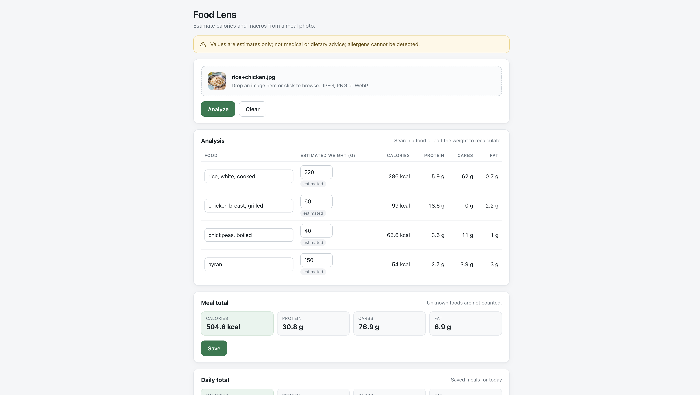

# Nusthera Food Lens

Upload a meal photo, get the foods with estimated grams, calories and macros, correct anything
that is wrong, save the meal and see the daily total.

The vision model only names foods and estimates portion weights. Every calorie, protein, carb
and fat number in this app is computed by our own code from `data/foods.csv`
(`grams x per-100g value / 100`). Nutrition values are never taken from the model.

## Demo

No hosted demo — run it locally with the commands below. This is the app in mock mode after
analyzing `eval/images/rice+chicken.jpg`, so you can reproduce exactly this screen without an API
key:



Every weight is editable and tagged `estimated` until you change it; every calorie and macro in the
table was computed from `data/foods.csv`, not returned by the model.

## Prerequisites

Exact versions this was built and tested with:

- **Python 3.14.2** (any 3.11+ should work; only the standard library plus the pinned packages are used)
- **SQLite** — no install needed, it comes with Python
- **A Gemini API key** — only for live mode. Mock mode needs no key.
- No Node.js, no Docker, no database server.

Key pinned packages (full list in `requirements.txt`): FastAPI 0.141.1, uvicorn 0.54.0,
pydantic 2.13.5, google-genai 2.25.0, python-multipart 0.0.32, pytest 8.4.2.

## Setup

macOS / Linux:

```bash
git clone https://github.com/cerenozd3/nusthera-food-lens.git
cd nusthera-food-lens
python3 -m venv .venv
source .venv/bin/activate
pip install -r requirements.txt
cp .env.example .env               # fill in VISION_API_KEY only if you want live mode
```

Windows PowerShell:

```powershell
git clone https://github.com/cerenozd3/nusthera-food-lens.git
cd nusthera-food-lens
python -m venv .venv
.venv\Scripts\Activate.ps1
python -m pip install -r requirements.txt
Copy-Item .env.example .env
```

`.env.example` ships with `MOCK_MODE=true`, so the copied `.env` works end to end without a key.
Mock mode does not need `VISION_API_KEY`. For live mode, put your Gemini key in `.env` as
`VISION_API_KEY=...` before starting the server.

## Run locally

Mock mode (no API key, reads recorded responses from `fixtures/`):

macOS / Linux:

```bash
MOCK_MODE=true .venv/bin/python -m uvicorn src.main:app --port 8000
```

Windows PowerShell (venv already activated):

```powershell
$env:MOCK_MODE="true"
python -m uvicorn src.main:app --port 8000
```

Live mode (calls Gemini; needs `VISION_API_KEY` in `.env`):

macOS / Linux:

```bash
MOCK_MODE=false .venv/bin/python -m uvicorn src.main:app --port 8000
```

Windows PowerShell (venv already activated):

```powershell
$env:MOCK_MODE="false"
python -m uvicorn src.main:app --port 8000
```

Then open **http://localhost:8000**.

You should see the "Food Lens" heading, the estimates disclaimer, an upload card with a disabled
**Analyze** button, and a **Daily total** card reading 0. Nothing else happens until you pick a
photo.

**In mock mode you must upload one of the three photos that have a recorded response**, because the
fixture is looked up by file name:

| Upload this file | Fixture used |
| --- | --- |
| `eval/images/rice.jpg` | `fixtures/rice.json` |
| `eval/images/rice+chicken.jpg` | `fixtures/rice+chicken.json` |
| `eval/images/bread.jpg` | `fixtures/bread.json` |

Any other file in mock mode returns a clear error listing the available fixtures. Mock mode never
invents a response.

## Usage flow

1. **Upload** a JPEG, PNG or WebP photo (drag and drop, or click the upload card). Max 8 MB.
2. **Analyze.** The photo goes to the vision model (or to `fixtures/` in mock mode). The model
   returns `{"items": [{"name", "grams", "confidence"}], "notes": "..."}` and nothing else.
   The response is validated with Pydantic; on an invalid or empty response the app retries once
   and then shows a plain error message instead of crashing.
3. **Read the table.** One row per food: food name, estimated weight, calories, protein, carbs, fat.
   The weight column is tagged `estimated` until you touch it, then `edited`. A food the model
   named that has no exact row in `data/foods.csv` shows as `unknown` on a red row, with no macros.
4. **Correct.** Type in the food box to search `foods.csv` by name and pick a real row; change the
   weight in the number box. Both trigger `POST /recalculate`, which recomputes from the CSV on the
   server. The browser never does nutrition math, and the vision model is not called again.
5. **Save.** `POST /save` recomputes one more time from the CSV, stores the rows in SQLite and
   returns today's total. Rows containing `unknown` cannot be saved.
6. **Daily total** card updates. It sums the meals saved today *since the server started*, not the
   whole history — see [Known limitations](#known-limitations--next-steps).

Refreshing the page clears the analysis on screen; saved rows stay in the database.

## Run the evaluation

Live run over all 15 labeled photos in `eval/labels.csv` (needs `VISION_API_KEY`, makes 15 API calls
and overwrites `eval/results/summary.md`):

macOS / Linux:

```bash
.venv/bin/python eval/run_eval.py
```

Windows PowerShell (venv already activated):

```powershell
python eval/run_eval.py
```

Prints the per-photo table, recognition rate, calorie error (mean and median) and the worst 3
photos with a reason for each.

Spacing the calls out helps with rate limits; the numbers in [Results](#results) came from a run
with `--delay 5`:

macOS / Linux:

```bash
.venv/bin/python eval/run_eval.py --delay 5
```

Windows PowerShell (venv already activated):

```powershell
python eval/run_eval.py --delay 5
```

Check `labels.csv` without calling the API at all:

macOS / Linux:

```bash
.venv/bin/python eval/run_eval.py --validate-only
```

Windows PowerShell (venv already activated):

```powershell
python eval/run_eval.py --validate-only
```

Keyless smoke run on the 3 fixtures (writes to a separate file so the live summary survives):

macOS / Linux:

```bash
.venv/bin/python eval/run_eval.py --mock \
  --labels eval/labels.smoke.csv --min-photos 3 \
  --output eval/results/summary.mock.md
```

Windows PowerShell (venv already activated):

```powershell
python eval/run_eval.py --mock `
  --labels eval/labels.smoke.csv `
  --min-photos 3 `
  --output eval/results/summary.mock.md
```

## Run tests

macOS / Linux:

```bash
.venv/bin/python -m pytest -q
```

Windows PowerShell (venv already activated):

```powershell
python -m pytest -q
```

116 tests pass. They cover the nutrition formula, exact-name matching and `unknown` handling,
Pydantic schema validation, the retry path, the rule that live mode never falls back to fixtures,
the upload and save endpoints, the food search UI contract, and the evaluation metrics. Gemini is
mocked in tests; no test makes a network call.

## Environment variables

| Name | Required | Description |
| --- | --- | --- |
| `VISION_API_KEY` | Only for live mode | Gemini API key. If it is empty and `MOCK_MODE=false`, `/analyze` returns a clear error instead of calling the API. |
| `MOCK_MODE` | No, defaults to `true` | `true` reads `fixtures/<image name>.json`; `false` calls Gemini. Mock is opt-in: live mode never silently falls back to fixtures. |
| `GEMINI_MODEL` | No, defaults to `gemini-3.5-flash-lite` | Model id used for live calls. This is the model behind the reported results. |
| `MAX_UPLOAD_MB` | No, defaults to `8` | Upload size limit. Bigger files get a 400 with a readable message. |
| `PORT` | No, defaults to `8000` | Read by `src/config.py` and kept in `.env.example` for reference. The port the server actually binds is the one you pass to `uvicorn --port`. |
| `DB_PATH` | No, defaults to `data/food_lens.db` | SQLite file for saved meals. Not in `.env.example`; set it only if you want the database somewhere else. |

`.env` is in `.gitignore` and no API key was ever committed; only `.env.example` with a placeholder
is tracked.

## Project structure

```
src/                  FastAPI app: routes, config, Gemini client, schema, matching, storage
  main.py             endpoints: / /health /analyze /foods /recalculate /save /daily
  models.py           Pydantic contract for the model response (items + notes)
  vision.py           prompt building, Gemini call, JSON parsing, one retry
  mock.py             fixture loading for MOCK_MODE=true
  foods.py            loads data/foods.csv, exact-name lookup, name search
  nutrition.py        grams x per-100g / 100, unknown handling, meal totals
  storage.py          SQLite: save rows, daily totals
  eval_metrics.py     pure evaluation logic: label parsing, scoring, summary rendering
  static/index.html   the single page UI
data/foods.csv        nutrition reference table, 55 foods, per 100 g, USDA FDC + TurKomp
fixtures/             recorded model responses for mock mode (3 photos)
eval/labels.csv       ground truth: 15 photos, name:grams items, true_kcal
eval/images/          the labeled photos
eval/run_eval.py      evaluation runner (live, --mock, --validate-only)
eval/results/         summary.md and the raw model responses from the last live run
tests/                116 pytest tests
ai-history/           exported Cursor sessions (sanitized)
docs/                 README screenshot
```

## Results

From the current `eval/results/summary.md` — a live run of all 15 labeled photos with
`gemini-3.5-flash-lite` and `--delay 5`. 18 labeled foods in total.

**Metric definitions (from the assignment):**

- **Recognition rate** = correctly found labeled foods / all labeled foods.
- **Calorie error** = mean of `|predicted kcal - true kcal| / true kcal`, as a percentage.

| Metric | Value |
| --- | --- |
| Recognition rate | **50.0 %** (9 of 18 labeled foods found) |
| Calorie error, mean | **30.6 %** |
| Calorie error, median | 21.5 % |
| Precision (predicted foods that were labeled) | 33.3 % (9 of 27) |
| Calorie bias (negative = underestimates) | +0.9 % |
| Photos | 15 scored, 1 failed, 0 skipped |
| Portion error, mean / median (auxiliary, not an assignment metric) | 18.7 % / 6.7 % over the 9 found foods |

A failed photo counts as 0 predicted kcal, i.e. 100 % calorie error. Recognition compares names
exactly (ignoring case and extra spaces).

### Worst 3 photos and why

| Photo | True kcal | Predicted kcal | Error | Why |
| --- | --- | --- | --- | --- |
| `cips.png` | 300 | 0 (failed) | 100 % | The model returned an empty `items` list, the single retry returned empty again, so the photo is scored as failed. `chips` has no row in `foods.csv` and the prompt asks the model to pick names from that list, so it has nothing to answer with. In an isolated diagnostic call with the same photo, prompt and model, it did answer — `french fries`, 85 g, with the note that no exact match for ridged potato chips exists. So the behaviour on this photo is not stable. |
| `tomato souce pasta.png` | 350 | 579 | 65.4 % | The labeled food `pasta, tomato sauce` has no row in `foods.csv`, so it can never be matched or priced. The model split the plate into four rows instead — `pasta, cooked`, `tomato`, `cheese, cheddar`, `olive oil` — which counts as one missed food plus three extras, and the added oil and cheese push the total 65 % over. |
| `bread.jpg` | 530 | 212 | 60 % | Pure portion error. The name `bread, white` was right; the model estimated 80 g against a 200 g reference. Bread weight is hard to read from a photo, and our own reference gram value here is an estimate, not a scale reading. |

### The same photo does not give the same answer twice

Recognition and calorie error move between runs even with identical code, prompt, model, photos and
labels — the model simply answers differently. Two consecutive live runs over the same 15 photos and
the same label file gave:

| Metric | Run A | Run B |
| --- | --- | --- |
| Recognition rate | 52.9 % (9/17) | 58.8 % (10/17) |
| Calorie error, mean | 34.9 % | 33.7 % |
| Calorie error, median | 35.6 % | 19.0 % |
| Precision | 33.3 % | 37.0 % |

Both runs used the label file from before a tomato was added to `lahmacun.png`, which is why the
denominator is 17 rather than 18. Run B additionally spaced the calls with `--delay 5`; that removed a
transient API error but has nothing to do with which foods the model names, so it does not explain the
gap. `lahmacun.png` is the clearest example: in one run the model
listed flatbread and tomato, in the next it listed only `lahmacun`. `izgara kofte.png` swung between
42 %, 56 % and 58 % calorie error across runs. **Treat the numbers above as one sample, not as a
stable measurement.** Averaging several runs would be more honest, but that is extra API quota and
the assignment does not ask for it.

## Known limitations / Next steps

**Limitations**

- **7 of the 18 labeled foods have no row in `foods.csv`**: `yogurt`, `salmon`, `salad`,
  `pasta, tomato sauce`, `chicken pasta`, `orange juice`, `chips`. They are real ground truth (that
  is what was on the plate), but they can never be matched by an exact-name comparison nor priced by
  our table, so they are permanently counted as missed. With this label set the recognition rate
  cannot exceed ~61 %. `summary.md` prints "6 of 18" for this because that note is only recorded for
  scored photos and `cips.png` failed; the seventh is `chips`.
- **Matching is exact name only** (case and whitespace insensitive). The model saying
  `salmon, grilled` while the label says `salmon` counts as a miss even though it is right. No alias
  table, no fuzzy matching — the food list goes into the prompt instead.
- **Small, single-labeler evaluation set.** 15 photos, 18 labeled foods, labeled by one person.
  Reference grams are eyeball estimates, not scale readings, and some `true_kcal` values come from a
  different source than `foods.csv`, so part of the calorie error belongs to the labels, not the
  model.
- **One run per number.** See the variance table above.
- **The Daily total card counts only meals saved since the current server start.** The rows stay in
  SQLite (`data/food_lens.db`, gitignored); restart the server and the card goes back to zero while
  the database still holds the history.
- **Mock mode covers 3 photos.** `rice.jpg`, `rice+chicken.jpg`, `bread.jpg`.
- **Failed live calls are not saved to `eval/results/raw/`**, so there are 14 raw files for 15
  photos and no raw file for `cips.png`.
- **No auth, one user, no meal history screen, no photo storage, file upload only** (no camera
  capture). Uploaded photos are held in memory for the request and never written to disk.
- **The live error message is generic.** Any non-schema exception from the API surfaces as "The
  vision model could not be reached", which hid a transient API failure for two evaluation runs
  until it was diagnosed separately.
- **No bonus-track work** (data pipeline, 40-photo tiered set, model comparison, analytics
  dashboard).

**Next steps, in the order they would pay off**

1. Add the missing foods to `foods.csv` with a cited source, or add an `eval/aliases.csv` so
   `salmon` and `salmon, grilled` count as the same food. Either one would move the recognition rate
   the most.
2. Log the real exception type and HTTP status from the API, and wait before the retry.
3. Run the evaluation 3 times and report the mean and the spread per photo.
4. Weigh the reference portions on a kitchen scale and derive `true_kcal` from `foods.csv` so label
   error stops leaking into the model's score.
5. Camera capture on mobile, and a meal history view.

## Troubleshooting

Errors actually hit while building this, and what fixed them.

**`Mock fixture for 'x.jpg' was not found. Available sample fixtures: 'bread', 'rice', 'rice+chicken'.`**
You are in mock mode and uploaded a photo with no recorded response. Upload one of the three listed
files from `eval/images/`, or switch to live mode. Mock mode deliberately errors instead of making
up a response.

**`VISION_API_KEY is missing. Set it in .env to use live vision.`**
`MOCK_MODE=false` but the key is empty. Put the key in `.env`, or set `MOCK_MODE=true`.

**`No module named uvicorn` (Windows PowerShell)**
`python -m uvicorn ...` is running the system Python, not the venv. Dependencies were almost
certainly installed before `.venv` was activated. Activate it and install again:

```powershell
.venv\Scripts\Activate.ps1
python -m pip install -r requirements.txt
```

Then start the server with `python -m uvicorn src.main:app --port 8000`. Do not use
`.venv/bin/python` or `MOCK_MODE=true python ...` in PowerShell.

**`The vision model could not be reached. Check VISION_API_KEY and try again.`**
Generic message for any non-schema failure from the API. During the evaluation this appeared for the
last photo of the batch in two runs while the other 14 succeeded; a single isolated call for the same
photo worked. It was a transient API failure from 15 back-to-back calls, and it stopped happening
with `python eval/run_eval.py --delay 5`.

**`No foods were detected in the photo. Try a closer, well-lit photo.`**
The model returned an empty `items` list, and the one retry returned empty again. Seen on `cips.png`,
whose labeled food `chips` has no row in `foods.csv` — but not every time, so it is the model's
behaviour on that photo rather than a hard rule.

**`Cannot use eval/labels.csv:` followed by a list of problems**
`labels.csv` validation is strict on purpose and reports every problem at once. Real ones we hit:

- `image 'banana.jpeg': file not found in the images folder` — the file is `banana.jpg`.
- `does not match the real file name exactly (case/Unicode); the file is 'ızgara kofte.png'` — the
  file name had a Turkish dotless `ı` and the label had a plain `i`. The check compares against the
  real directory listing because macOS ignores case while a Linux clone does not.
- `too many columns. Quote fields that contain commas` — an image named
  `rice,grilled cgic,salad.png` broke the CSV; the file was renamed to `ricegrilledcgicsalad.png`.
- `'banana' must be written name:grams` — every item needs a reference weight, e.g. `banana:120`.

Run `python eval/run_eval.py --validate-only` to see all of this without spending API calls.

**The mock evaluation wiped my live results.**
`run_eval.py` writes to `eval/results/summary.md` by default, in every mode. Pass
`--output eval/results/summary.mock.md` for smoke runs, as shown above.

**`Unknown foods cannot be saved.` (422 on Save)**
At least one row is still `unknown`. Search the food box for a real `foods.csv` name, or you cannot
save that row — the app will not guess nutrition for a food it does not have.

**`[Errno 48] Address already in use`**
Port 8000 is taken. Use `--port 8001` and open that port instead.

**The server starts but every food shows as `unknown`.**
This was a real bug during development: the UI was rebuilding food names from parsed fragments
instead of using the exact CSV name from `/analyze`. The fix was to keep the exact name end to end.
If you see it again, compare the `name` field in the `/analyze` response with what the table shows.
